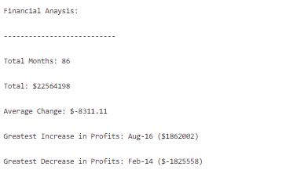
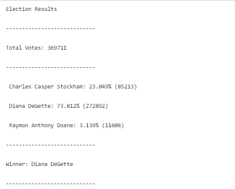

# python-challenge
This project is broken into two parts. The first section (PyBank) analyzes a bank's financial records and returns a financial summary for the given time period. The second section (PyPoll) analyzes election results and displays the the number of votes and percentage of votes for each candidate and displays the winner.

<h2>PyBank</h2>
To perform the analysis, open and run the 'main.py' located in the PyBank folder. The script will print the financial analysis as well as export the analysis as a text file. The output should look like this:
 

<h2>PyPoll</h2>
To perform the analysis, open and run the 'main.py' located in the PyPoll folder. The script will print the election analysis as well as export the analysis as a text file. The output should look like this:
 

